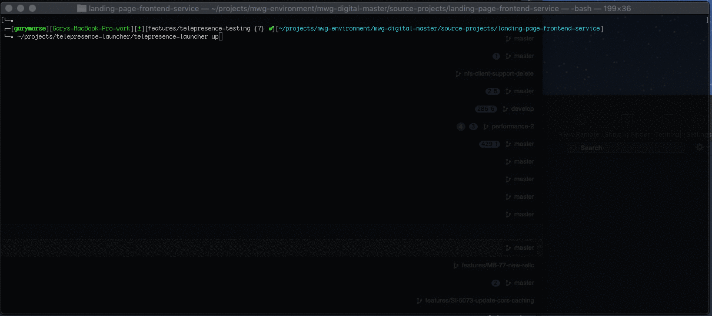

# Telepresence Launcher

`telepresence-launcher` provides a guided interface to replace a Kubernetes deployment in an established K8s context in a consistent manner using [Telepresence](https://www.telepresence.io/).



## Beta!!

The functionality of this application and the structure of the configuration file may change without notice. While in beta we make no promises of backward compatibility!

## Background

[Telepresence](https://www.telepresence.io/) is an amazing tool for debugging and coding against a service that normally runs in a Kubernetes cluster and has dependencies on other services. Since running an entire kubernetes stack locally is not always feasible due to compute power constraints or complexity, a developer can use telepresence to "patch" their local running service into a full environment running elsewhere (such as a cloud provider).

When first investigating using Telepresence as a tool for our team of devs, the first issue we ran into was the amount of information you needed to know just to be able to run the `telepresence` command. In many cases, you need to know the Kubernetes namespace, the name of the deployment you are replacing, the method of replacement as well as any specifics needed for starting the local service and its volumes.

The problem described above is what Telepresence Launcher aims to solve.

## How it Works

Telepresence Launcher uses a configuration file (.tl.yaml) that is kept in the root directory of your service's source code. The data in this configuration file outlines the parameters necessary to present the user a guided interface for launching telepresence for that specific code. When the developer runs `telepresence-launcher up`, Telepresence Launcher asks questions based on the configuration as well as data it gathers from the Kubernetes cluster. After the developer answers a few questions, telepresence launcher will do a number of things.

1. If specified in the configuration, it will run pre-launch shell commands (docker build, custom scripts etc...)
2. If specified in the configuration, it will create docker volumes (for mounting local source code into a container)
3. Generate and run the `telepresence --swap-deployment` command with all of the chosen configuration options.

### Supported `--method`s

Currently this tool only supports the `--method container` method. More methods will be added as time permits. If you would like to add another method, feel free to open an issue and create a PR!

### Anatomy of .tl.yaml Configuration File

``` yaml
# The labelSelector value is used when querying the kubernetes cluster for a a list of namespaces to present to the user.
labelSelector: "app=my-service"
# The value of repo is used to filter the namespace choices shown to the user in the prompt for selecting a namespace.
repo: my-service-namespace
# A list of kubernetes deployments that could be launched by this config. a user will choose one from the prompt.
deployments:
  # The deployment name (or a partial match) for the deployment to be swapped.
  my-service:
    # The list of launch methods supported by this service
    launchMethods:
        # --method container
      - method: ContainerMethod
        # A list of shell commands and arguments to run before launching telepresence.
        buildSteps:
          # Each build step takes a command (string) and arguments (array) to run the command.
          - cmd: docker
            args: ["build", "-t", "mycompany/myservice:dev", "--target", "build", "."]
          - cmd: "my-custom-script.sh"
            # Note: environment variables are supported in the args.
            args: ["arg1", "${PWD}", "arg2", "arg3"]
        # An array of volumes to mount into the container. each of these will result in a `docker volume create` command.
        volumes:
          - name: my-volume
            src: ${PWD}
        # An array of mounts - each of these will result in a --mount flag in your --docker-run comamnd
        mounts:
          - type: volume
            source: my-volume
            destination: /usr/src/app
        # An array of environment variable overrides. each will result in a -e flag in your -docker-run command.
        env:
          - "NODE_ENV=dev"
        # The image to run. NOTE: this image was build above in the buildSteps.
        image: mycompany/myservice:dev
        # Array of commands to run when starting the container.
        commands: ["npm", "run", "debug"]
```

## Requirements

To use Telepresence Launcher you will need the following items set up on your machine.

1. Telepresence - you need to [install telepresence](https://www.telepresence.io/reference/install) yourself.
2. Linux or MacOS - both have been tested. This tool has not been tested on windows.
   1. NOTE: for MacOS, this tool will mount volumes using Docker for Mac's native NFS support. You must have NFS server running on your local machine and advertise your source code directory in the exports file. This may be made into a configuration item in the future. [Read this article](https://medium.com/@sean.handley/how-to-set-up-docker-for-mac-with-native-nfs-145151458adc) for a walkthrough
3. A working connection to the kubernetes cluster where your development environment lives.
   1. Telepresence Launcher will use the currently configured kubernetes context on your machine to query the cluster. Before using telepresence launcher, make sure you have a working connection to the cluser and the proper permissions.
4. Docker (for the `container` method)
   1. Telepresence Launcher uses your local docker install to build and launch the docker container.

## Development

Working on this project requires having [Go 1.11 or greater installed](https://golang.org/doc/install).

### Building

To build the `telepresence-launcher`:

1. If you cloned the repo within your $GOPATH, manually activate module mode:

    ```bash
    export GO111MODULE=on
    ```

2. Build the binary

    ```bash
    go build -mod=vendor .
    ```

### Dependency management

This repository makes use of [Go's modules](https://github.com/golang/go/wiki/Modules), with [vendoring](https://github.com/golang/go/wiki/Modules#how-do-i-use-vendoring-with-modules-is-vendoring-going-away) for dependency management.

When a dependency is added to the codebase, `go mod vendor` should be ran.
